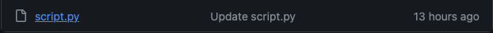
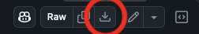
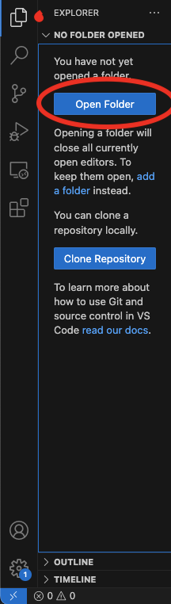
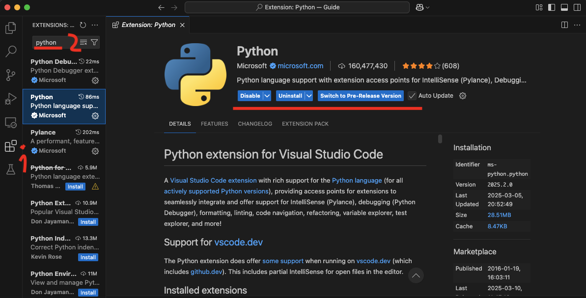
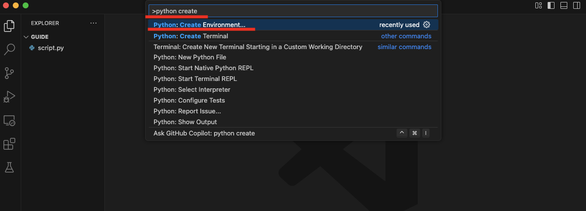
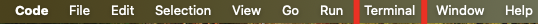
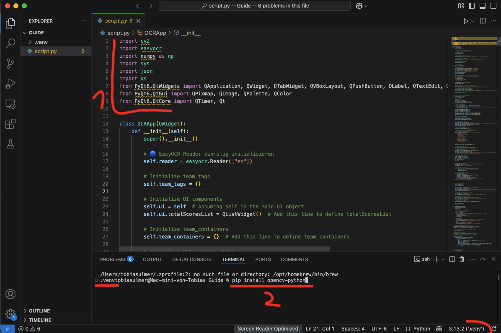
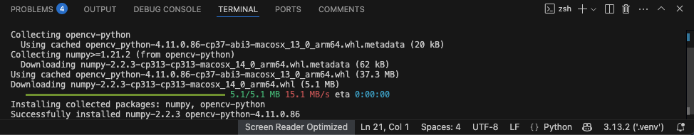

<h1 align="center" >About</h1>
This is a work in progress tool for the Mario Kart Scene, currently featuring:   

-  Automated Scoreboard for 8dx Lounge, Teammodes 2v2, 3v3, 4v4

********

<h3 align="center" >Hints</h3>
As i want this to be avaible for everyone, i could not figure out a way to turn this program into a stable application. So in order to use this, you need to run the source code

********

<h2 align="center" >Quick Tutorial</h2> 
<h6 align="center" >This is just a quick walkthrough, more detailed explanations below</h6>

1. Download the file "script.py" from this repository
2. Download and install Python
3. Download and install a Programming Development Environment (like Visual Studio Code)
4. Open the Program from step 3, create a project (folder) and add the "script.py" file to it
5. Get Python to run in your project -> for Visual Studio Code: Navigate to Extensions on the left sidebar, search for "Python" and install it (you should get 3 Python Related Extensions). Then, you need a Virtual Environment. Press "Shift + Ctrl + P", search "Python: Create Environment" and select it, select "venv", select Python. In case of errors, restart Visual Studio Code and repeat until it works
6. Open a Terminal (top bar) and install all required Packages (*opencv-python* | *numpy* | *easyocr* | *pyqt6*). To do so, Run "pip install *package-name*" inside your Terminal
7. Now run the Program (in VSC: either press the ▶︎ Button or type "python script.py" in the Terminal)
8. That's it! 2 Windows should open and you are free to explore what the program has to offer. More details about the controls and OBS will be at the end of the detailed explanation
 

<h1 align="center" >Detailed Installation Guide</h1>

<h6 align="center" >this guide is made with the programs i have been developing this project with. Other programs can work, but this guide might not be suited for them</h6>

<h3 align="center" >Step 1: Resources</h3>

[Download](https://www.python.org/downloads/) and install the latest Version of Python for your system

[Download](https://code.visualstudio.com/) and install the latest Version of Visual Studio code for your system

Above the ReadMe, where all the files of this program are located:

Click on script.py

At the right side, above the code, click on "download raw file"

Lastly, create an empty folder on your Desktop and name it "Guide" (You may name it what you like, i will refer to it as Guide). Then, move the "script.py" file you downloaded into the "Guide" folder

<h3 align="center" >Step 2: Setting up VSC</h3>

Open Visual Studio Code

 

Navigate to "Explorer" on the **Left Sidebar** and after, press on "open folder". Select your Folder "Guide" located on your desktop. You should now see the file "script.py" to the left

Navigate to Extensions on the **Left Sidebar** (1) and search for Python (2). Click on the Extension solely called "Python", as shown in the image, and install it (Python Debugger and Pylance should be installed with it)

Click on the Seach Bar at the top and type ">Python Create Environment". Click it, then select "venv", and after select the Python version you dowloaded before. The Virtual Environment venv should now be created

Open a Terminal through the **Top Menu Bar**

To finish, we need to install all the Libraries (1) the program needs to work. To do so, Type the line "pip install opencv-python" into your Terminal and press Enter.

Wait for the installation to finish (bigger packages may take a while), it might not always say in the Terminal it finished, but it *will always make a Sound* when the Terminal is ready again. 
Repeat the process for the other Libraries. Run the following lines in your Terminal:

-  pip install numpy
-  pip install easyocr
-  pip install pyqt6

<h3 align="center" >That's it!</h3>

You should now be able to run the program by pressing the ▶︎ Button (or by typing "python script.py" into the Terminal). 2 Windows will open and you are good to go!

<h3 align="center" >Step 3: OBS</h3>

Setting up the results Table is very simple. After opening the program, add a Window Capture to your scene in OBS, select the window "Scoreboard OBS Cleanfeed" and apply it. After, right click your new Window Capture in your scene and select "Filter". Add an Effectfilter with the + on the bottom left, choose Chroma Key. Set the Key-Color to "green" (should be the default) and apply. Done!

<h1 align="center" >Controls and Tips</h1>
<h6 align="center" >Here you will find Information and Knowledge about this program and how it works. Refer to this place if you run into issues, this will be updated in case i make changes</h6>

<h3 align="center" >General Stuff</h3>

Team-Tag1 will be shown in golden color on the Scoreboard

The results of detection will always be shown in the tab "Process"

The program currently only supports english language, so only Romanian letters and simple symbols (e.g. (),",[],/)

<h3 align="center" >Setting Up</h3>

Go into the Tab "Video-Setup" and press the Button. The program will search for 10 external Video Devices connected to your Computer, list them and show the active Device below. If your Capture Card is not shown immediatly, select the other Devices from the dropdown list

<h3 align="center" >Automatic Mode</h3>
<h6 align="center" >Important Note: This program does not read any of the numbers on the Scoreboard, it only reads from the namefield and applies scores based on locations. Meaning, this program only works race by race and needs every races Scoreboard. Make sure to take Screenshots at the end of a race, before the Scoreboard is sorted</h6>

The "Start" Button will be activated, once you connected your Capture Card and applied the Team-Tags

The program triggers once it "sees" the 12th player and after a succesful trigger, it will be set on cooldown for 120 seconds

Feel free to test it with old Screenshots

Make sure to use the "Reset" Button before starting, as the memory will be saved within the program even after closing it. Reset will delete all Team-Tags, Scores and the Racecount from Memory and it will stop the Automatic Mode.

<h3 align="center" >Manual Trigger and 6v6</h3>

The Button "Manual Trigger" can be used anytime, even without Team-Tags, results will be shown.

As this program can not detect special symbols of Clantags, you need to use the "Manual Trigger" to get the "Automatic Mode" working for 6v6. Take a Screenshot and Run the "Manual Trigger" without adding Team-Tags. Look at the Results, all 6 players Tags of a team should be detected with the same letter(s). Use the Results to Apply the Team-Tags

<h3 align="center" >Score-Settings Tab</h3>
<h6 align="center" >In this Tab of the Program you can adjust the Scores of the Teams, changes are immediatly applied to the Table</h6>

Teams are sorted by Points, use the "+" and "-" Button to the right of a Team to adjust the Score (Increments of 1 for each press)

"Missing" Points tell you that a Player could not be occupied to a team and theire Points are collected in the List. Make sure to remove the Points from "Missing" when you give them to a Team

A total Counter is running in the Background, it will tell you when the Points of all Teams do not match with the Race. You will see it when you adjust the Scores
