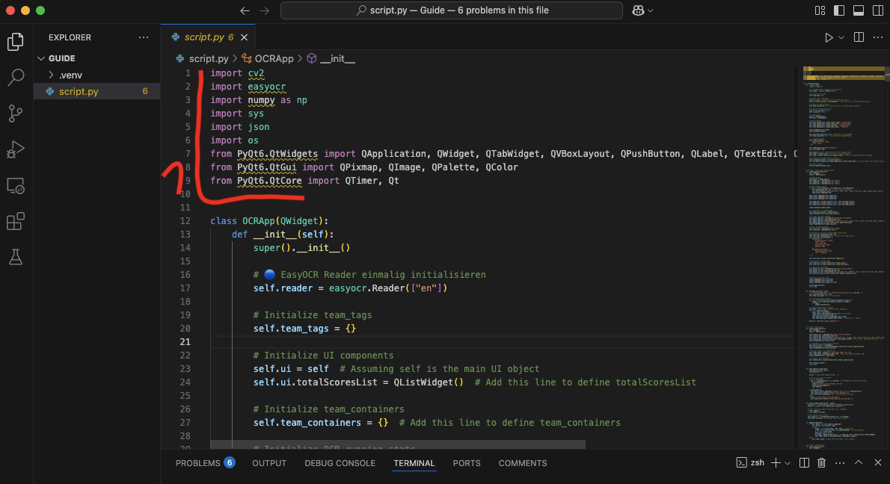

<h1 align="center" >About</h1>
This is a work in progress tool for the Mario Kart Scene, currently featuring:   

-  Automated Scoreboard for 8dx Lounge, Teammodes 2v2, 3v3, 4v4

********

<h3 align="center" >Hints</h3>
As i want this to be avaible for everyone, i could not figure out a way to turn this program into a stable application. So in order to use this, you need to run the source code

********

<h2 align="center" >Quick Tutorial</h2> 
<h6 align="center" >This is just a quick walkthrough, more detailed explanations below</h6>

1. Download the file "script.py" from this repository
2. Download and install Python
3. Download and install a Programming Development Environment (like Visual Studio Code)
4. Open the Program from step 3, create a project (folder) and add the "script.py" file to it
5. Get Python to run in your project -> for Visual Studio Code: Navigate to Extensions on the left sidebar, search for "Python" and install it (you should get 3 Python Related Extensions). Then, you need a Virtual Environment. Press "Shift + Ctrl + P", search "Python: Create Environment" and select it, select "venv", select Python. In case of errors, restart Visual Studio Code and repeat until it works
6. Open a Terminal (top bar) and install all required Packages (*opencv-python* | *numpy* | *easyocr* | *pyqt6*). To do so, Run "pip install *package-name*" inside your Terminal
7. Now run the Program (in VSC: either press the ▶︎ Button or type "python script.py" in the Terminal)
8. That's it! 2 Windows should open and you are free to explore what the program has to offer. More details about the controls and OBS will be at the end of the detailed explanation
 

<h1 align="center" >Detailed Installation Guide</h1>

<h6 align="center" >this guide is made with the programs i have been developing this project with. Other programs can work, but this guide might not be suited for them</h6>

<h3 align="center" >Step 1: Resources</h3>

[Download](https://www.python.org/downloads/) and install the latest Version of Python for your system

[Download](https://code.visualstudio.com/) and install the latest Version of Visual Studio code for your system

Above the ReadMe, where all the files of this program are located:

Click on script.py

At the right side, above the code, click on "download raw file"

Lastly, create an empty folder on your Desktop and name it "Guide" (You may name it what you like, i will refer to it as Guide). Then, move the "script.py" file you downloaded into the "Guide" folder

<h3 align="center" >Step 2: Setting up VSC</h3>

Open Visual Studio Code

 

Navigate to "Explorer" on the **Left Sidebar** and after, press on "open folder". Select your Folder "Guide" located on your desktop. You should now see the file "script.py" to the left

Navigate to Extensions on the **Left Sidebar** (1) and search for Python (2). Click on the Extension solely called "Python", as shown in the image, and install it (Python Debugger and Pylance should be installed with it)

Click on the Seach Bar at the top and type ">Python Create Environment". Click it, then select "venv", and after select the Python version you dowloaded before. The Virtual Environment venv should now be created

Open a Terminal through the **Top Menu Bar**

To finish, we need to install all the Libraries (1) the program needs to work. To do so, Type the line "pip install opencv-python" into your Terminal and press Enter.

Wait for the installation to finish (bigger packages may take a while), it might not always say in the Terminal it finished, but it *will always make a Sound* when the Terminal is ready again. 
Repeat the process for the other Libraries. Run the following lines in your Terminal:

-  pip install numpy
-  pip install easyocr
-  pip install pyqt6

<h3 align="center" >That's it!</h3>

You should now be able to run the program by pressing the ▶︎ Button (or by typing "python script.py" into the Terminal). 2 Windows will open and you are good to go!

<h3 align="center" >Step 3: OBS</h3>

Setting up the results Table is very simple. After opening the program, add a Window Capture to your scene in OBS, select the window "Scoreboard OBS Cleanfeed" and apply it. After, right click your new Window Capture in your scene and select "Filter". Add an Effectfilter with the + on the bottom left, choose Chroma Key. Set the Key-Color to "green" (should be the default) and apply. Done!
